# 깃허브 시작하기

## 깃허브 가입하기

먼저 **깃허브**(https://github.com)로 이동합니다.

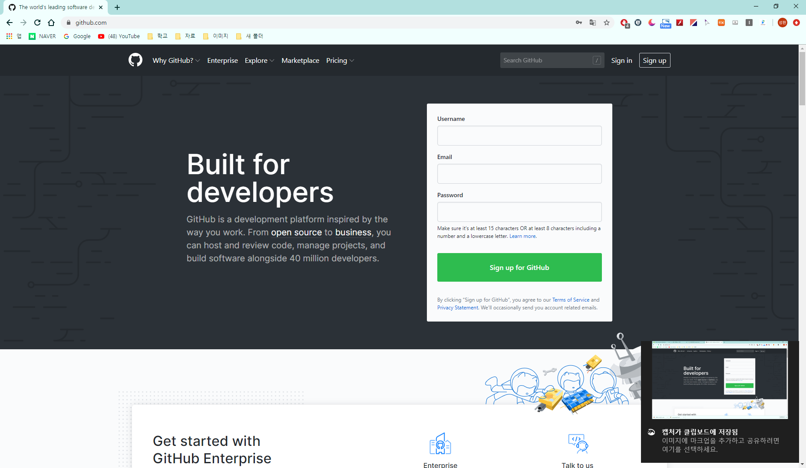

**sign in for Github** 를 눌러 회원가입을 하겠습니다.

원하는 id와 사용하려는 email을 넣고 가입합니다.

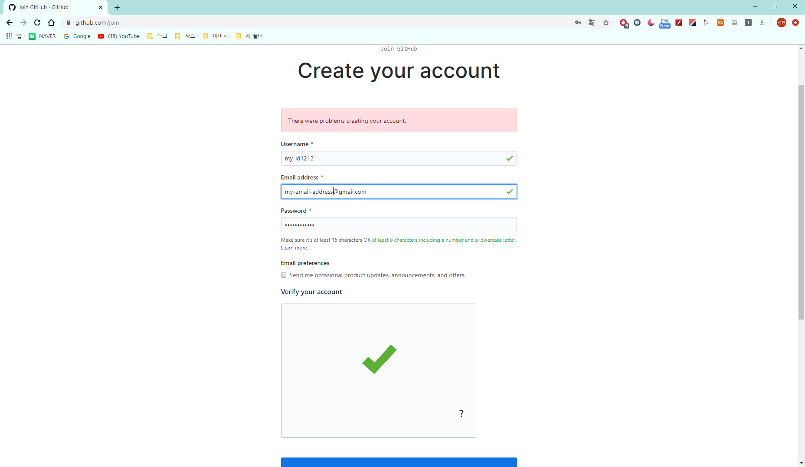

plan은 free를 선택하겠습니다.

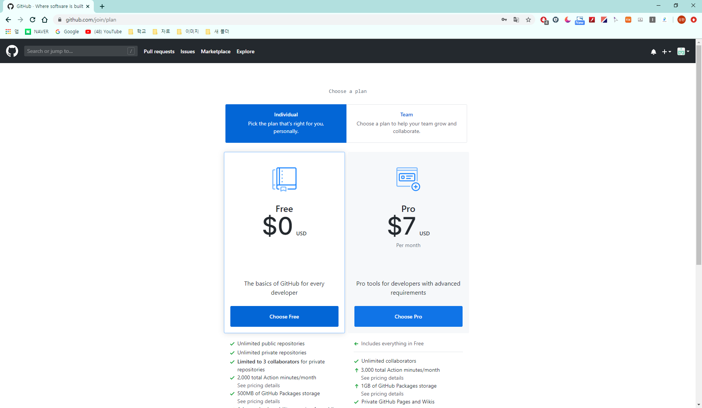

이후 관심사 등을 선택하라는 창이 나오는데 무시하면 됩니다.

## 깃 설치하기

구글에 **git download**를 검색해서 최상단의 페이지로 이동합니다.

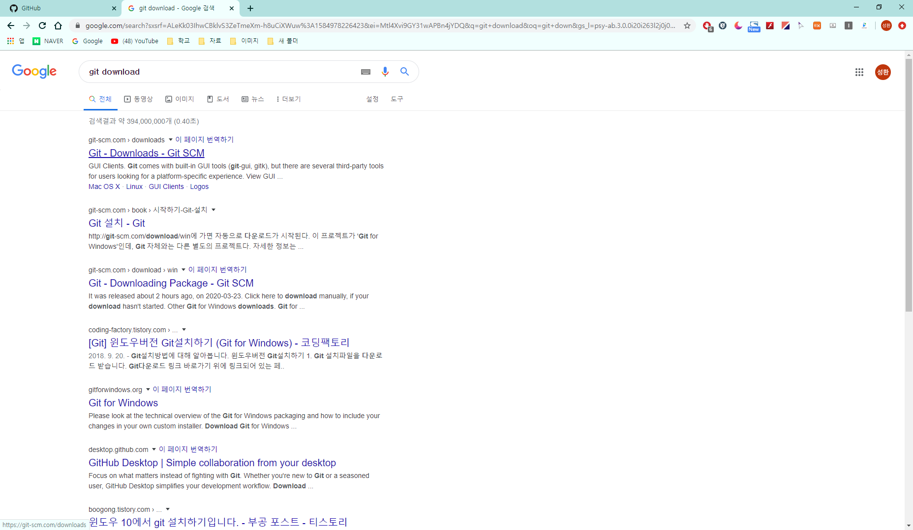

윈도우를 기준으로 했을때 청록색 모니터의 **download를** 누르고 git을 설치합니다.

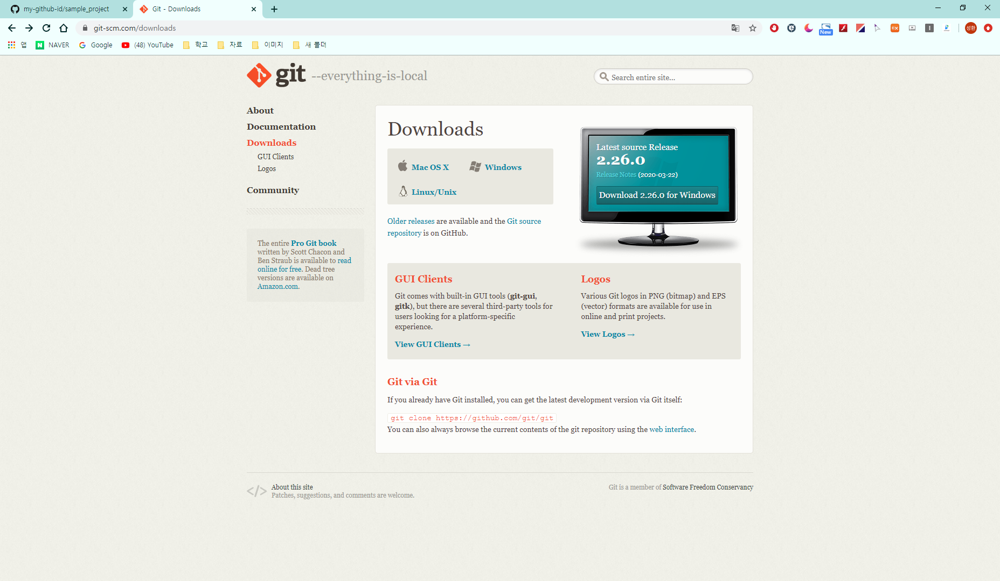

설치 과정에서 나오는 선택사항들은 모두 next를 눌러서 넘기겠습니다.

## 깃 초기설정 하기

윈도우 검색으로 **git bash**를 실행합니다.

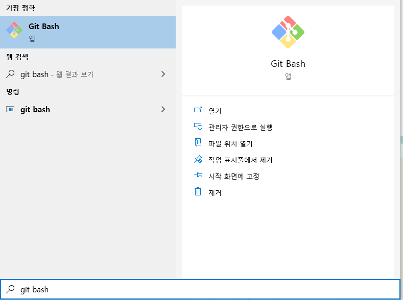

다음 사진과 같이 

**git config --global user.name 이름**

**git config --global user.email 회원가입했던 깃허브 메일**

처럼 설정하겠습니다.

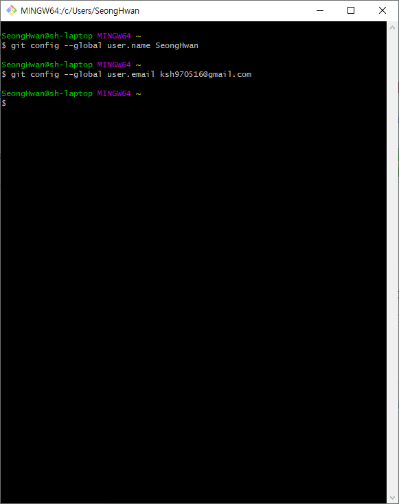

정상적으로 설정 되었다면 **git config -l** 입력시 입력했던 name과 email을 확인할 수 있습니다.

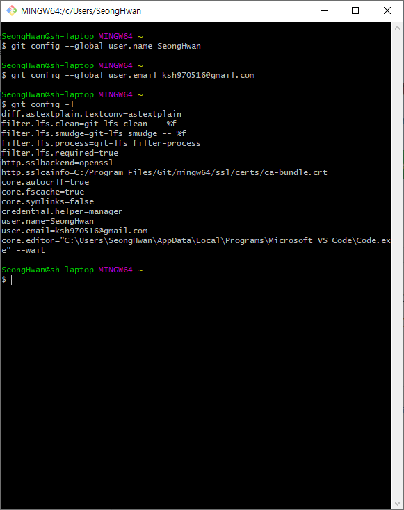

## 리포지토리(저장소) 생성하기

이전에 가입한 깃허브 페이지를 들어가서 우측 상단의 프로필 메뉴중 **Your repositories**로 이동합니다.

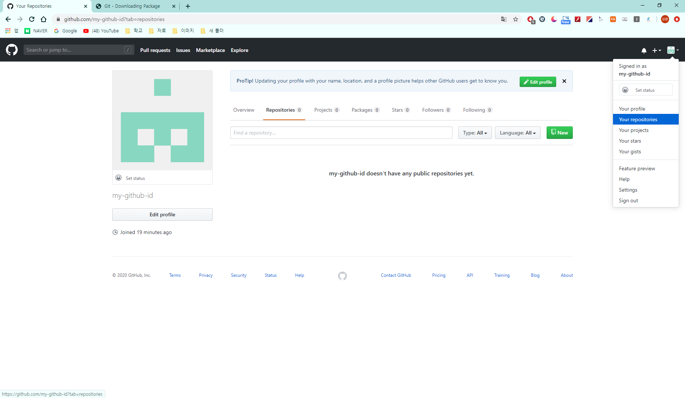

여기에 **New**를 클릭하여 새로운 리포지토리를 만들어 보겠습니다.

프로젝트명은 원하는 이름을 넣으면 됩니다.

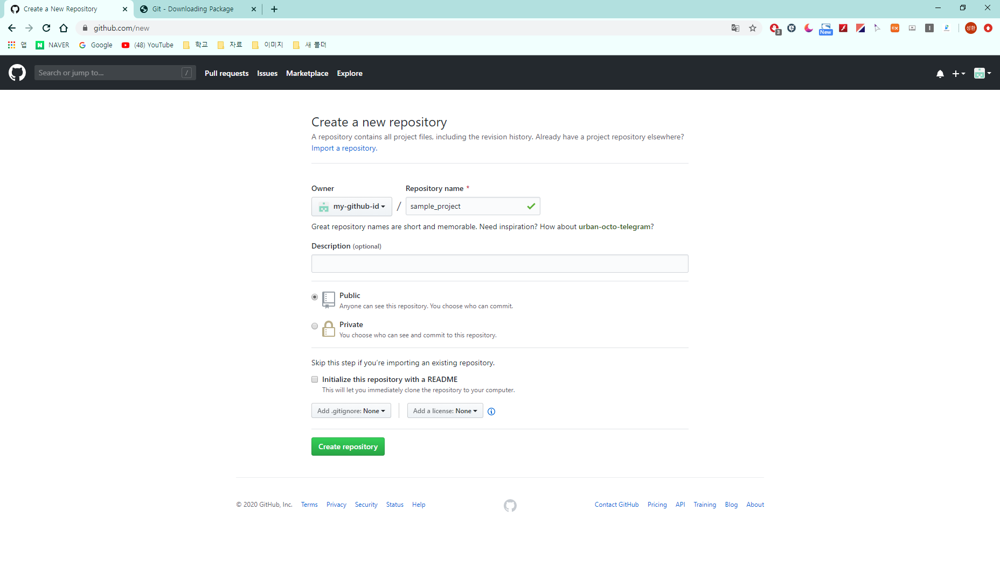

리포지토리를 생성하면 다음과 같은 창이 떠오릅니다.

여기서 빨간 박스 안에 버튼을 클릭해서 내용들을 복사하겠습니다.

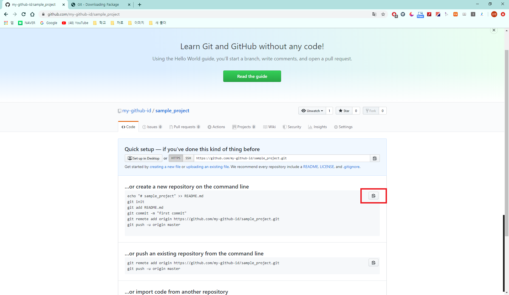

깃허브는 소스코드를 관리할 수 있는 git의 **원격 저장소** 역할을 합니다. 자세한 기능은 필요할 때 찾으면 되므로 여기서는 데스크탑에 있는 파일들을 네이버 클라우드나 구글 드라이브, 원드라이브 처럼 웹 상의 저장소에 업로드할 수 있다는 것만 알면 됩니다.

## 리포지토리 연동하기

웹(깃허브)상에서 생성한 리포지토리를 사용하는 데스크탑에 가져와 보겠습니다.

저는 e 드라이브의 github_sample이라는 폴더와 리포지토리를 연동하겠습니다.

먼저 이전에 설치한 깃배쉬를 실행하여 폴더로 이동합니다.

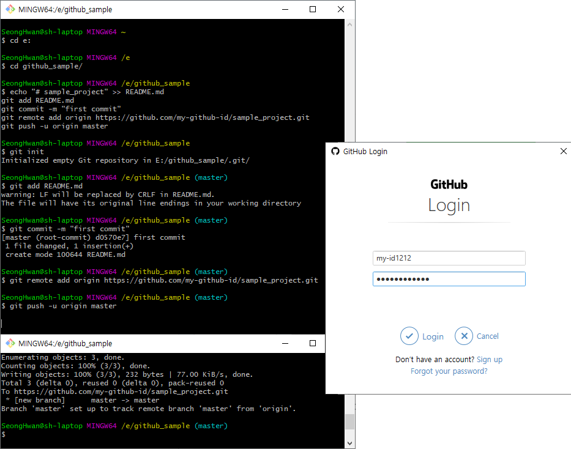

순서대로 살펴보자면

**cd e:**  - e:로 이동합니다.

**cd github_sample/**  - 현재 이동한 e 드라이브 내의 github_sample 폴더로 이동합니다.

여기서 이전에 복사해두었던 명령어를 붙여넣기 하겠습니다. 깃배쉬에서는 ctrl + v 로 붙여넣기가 동작하지 않으니 우클릭 후 paste 혹은 shift + insert로 붙여넣기를 할 수 있습니다.

**echo**와 **git init**은 README.md 라는 파일을 생성하고 깃을 관리하는 .git 폴더를 생성한다는 것만 알면 됩니다.

**git add README.md** - commit 하려는 파일 목록에 README.md 파일을 추가합니다.

**git commit -m "first commit"** - first commit이라는 메세지와 함께 추가된 목록 내역을 저장합니다.

**git remote add origin ...** - 현재 데스크탑에 위치한 폴더와 깃허브(원격 저장소)를 연동하는 명령어입니다. 처음 시작할때만 사용하기 때문에 굳이 이해할 필요는 없습니다.

**git push -u origin master** - 저장한 목록들을 원격 저장소에 업로드 하는 과정입니다.

처음 명령어를 입력했을때는 오른쪽 사진처럼 깃허브 로그인이 필요합니다. 가입했던 정보로 로그인 하면 아래와 같이 원격 저장소로 push 되는 과정을 볼 수 있습니다.

이후 다시 깃허브 사이트와 폴더를 보면 리포지토리에 README.md 파일이 추가된걸 볼 수 있습니다.

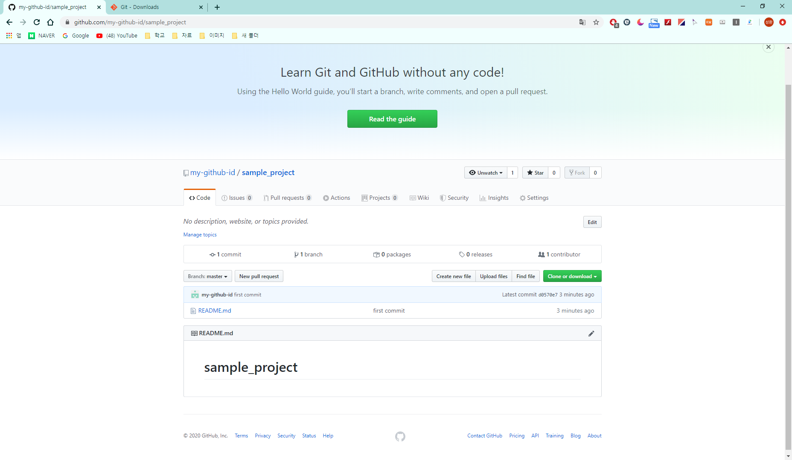

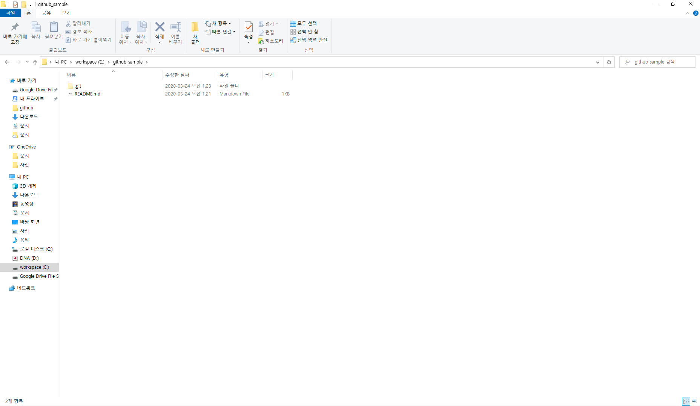

## 새로운 파일을 깃허브로 업로드하기

깃배쉬를 사용해서 새로 만든 파일을 깃허브로 올려보겠습니다.

여기서는 간단한 텍스트 파일이지만 소스 코드 파일이 될 수도 있고 원하는 파일을 업로드 할 수 있습니다.

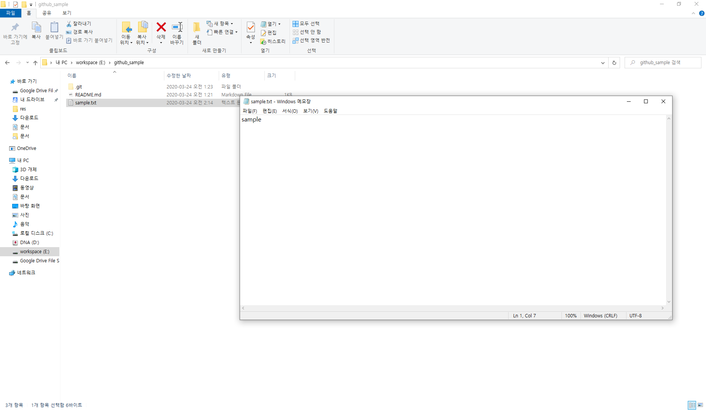

간단한 파일을 데스크탑에 생성했습니다.

깃허브로 파일을 업로드 하기 위해 깃배쉬를 키고 이전처럼 현재 폴더로 이동하고 명령어를 입력합니다.

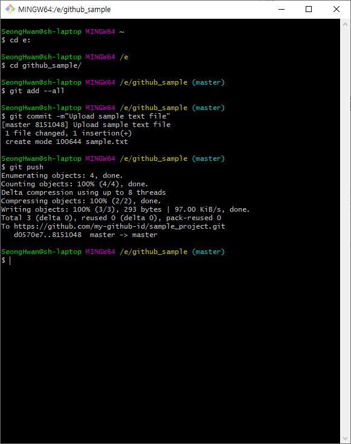

cd 명령어로 github_sample 폴더로 이동합니다.

**git add --all** 명령어는 현재 저장소에서 변경된 내역들을 모두 추가해주는 명령어입니다.

**git commit -m"원하는 커밋 메세지"** 이후 **git push**를 입력하면 깃허브에 텍스트 파일이 업로드된걸 볼 수 있습니다.

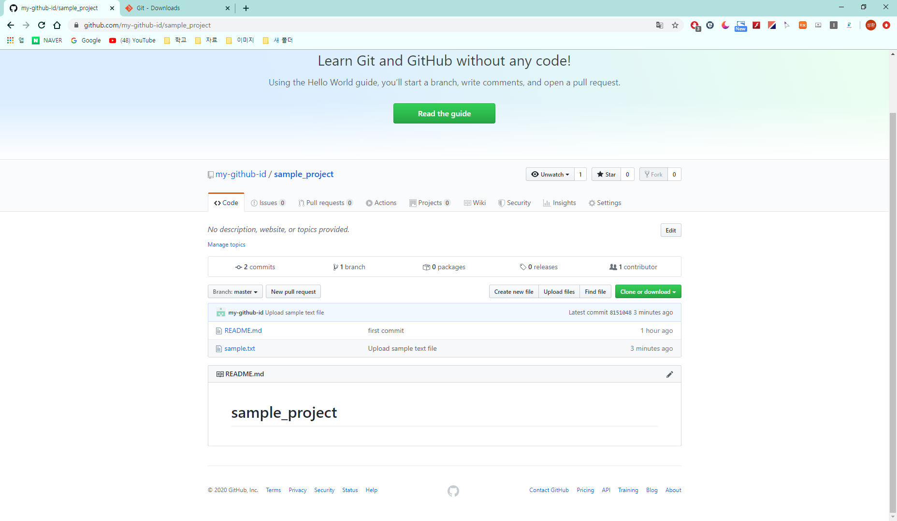

## 다른 리포지토리 가져오기

깃허브에 있는 다른 리포지토리를 데스크탑으로 가져올 수 있습니다. 먼저 가져오고싶은 리포지토리로 이동합니다.

이 리포지토리를 가져와 보겠습니다.(https://github.com/pknunan/2020_problem_sovling)

리포지토리에서 **clone or download** 버튼을 눌러 URL 오른쪽에 있는 버튼으로 주소를 복사합니다.

리포지토리를 가져오고 싶은 위치로 이동한후 다음 사진처럼 명령어를 입력합니다.

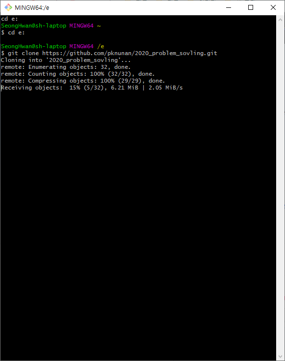

**git clone 리포지토리의 URL** - 리포지토리에 담긴 파일들을 데스크탑으로 복사하는 명령어 입니다.

클론이 완료되면 데스크탑에 2020_problem_solving 리포지토리가 생성된것을 볼 수 있습니다.

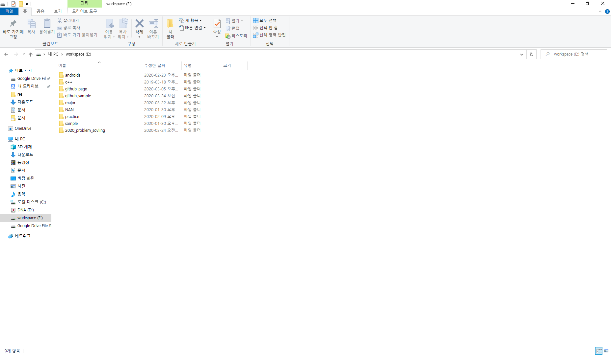

깃허브를 사용하면 여러명의 팀원들과 공동으로 프로젝트를 진행할 수 있습니다. 

다른 사람이 push 해서 리포지토리에 변경사항이 생긴다면 **git pull** 명령어로 자신의 데스크탑의 저장소를 최신화할 수 있습니다.

깃허브는 자신이 작성한 코드를 업로드하여 다른 사람들과 공유하는것 뿐만 아니라 프로젝트를 관리하는 기능들이 많기때문에 일찍 깃허브를 관리하며 익숙해 지는것이 많은 도움이 됩니다. 