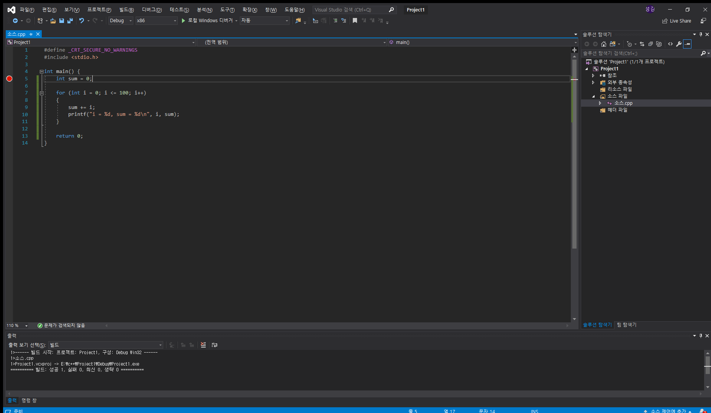
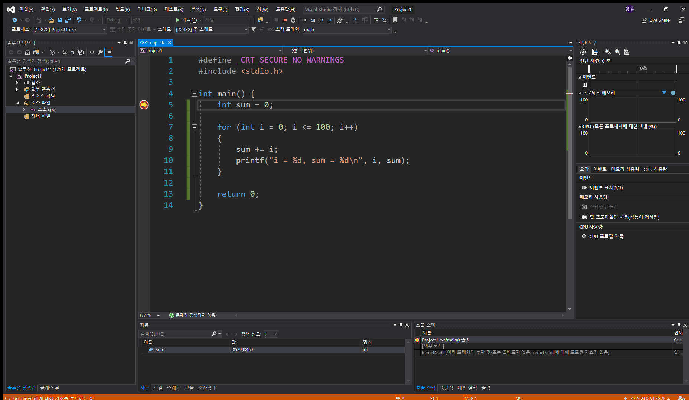
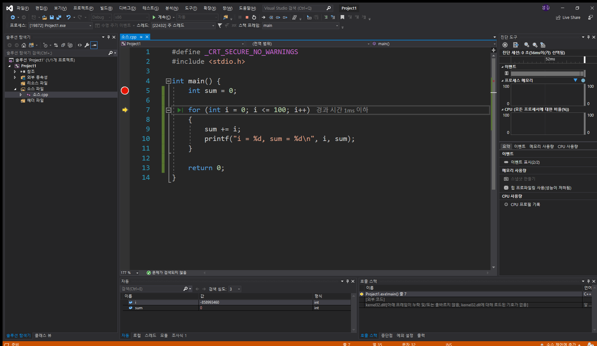
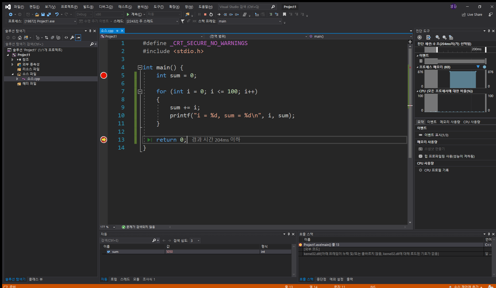
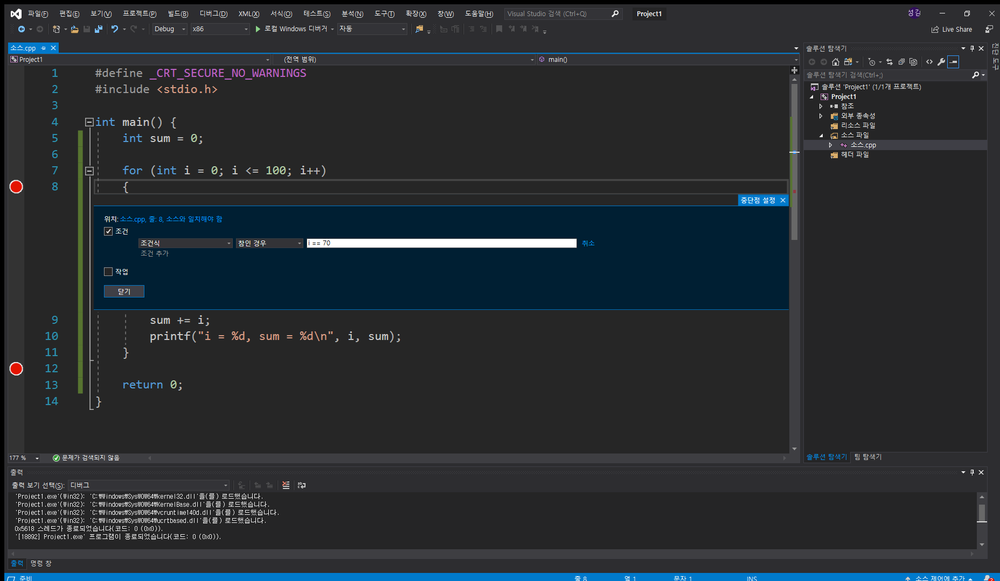
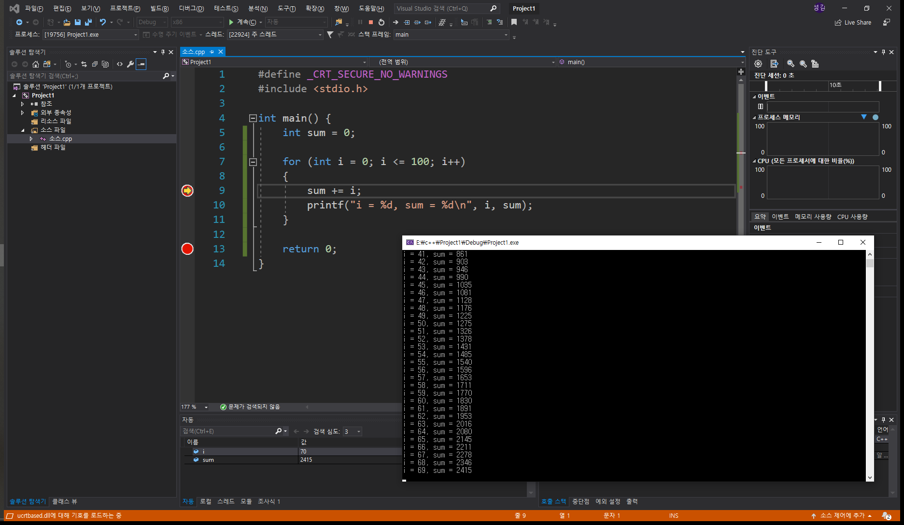

# 디버깅

디버깅은 코드를 원하는 지점부터 한 라인씩 실행하여 프로세스의 흐름과 데이터의 변화를 추적하여 원하는 결과값이 나타나는지 확인할 수 있는 작업입니다. 

## 중단점 지정

디버깅을 위해서는 중단점을 지정하여 어느 위치에서 프로세스의 진행을 멈출지 지정해야 합니다.

1부터 100까지 더하는 소스의 시작에 F9 로 중단점을 지정할 수 있습니다.

중단점이 지정 되었다면 F5를 눌러 디버그 모드로 들어갈 수 있습니다. 

## 디버그

디버그를 실시하면 코드의 흐름이 중단점에서 멈춰 있으며 화살표가 실행할 라인을 표시하는 것을 볼 수 있습니다.

아래에 활성화된 창 중 "자동" 창을 보면 sum이라는 변수가 생겼지만 아직 초기화가 되지 않아 쓰레기 값이 들어있는 것을 볼 수 있습니다. 

## 라인 단위로 실행

디버그중 F11을 눌러 코드를 라인 단위로 실행할 수 있습니다. F10은 프로시저 단위의 실행으로 이후에 함수를 사용하게 되면 함수 내부로 코드의 흐름을 이동할 수 있습니다.

F11을 한번 누르고 자동 창을 보면 i라는 변수가 생성되었고 sum이 0으로 초기화된것을 볼 수 있습니다. 

## 중단점간 이동

디버그중 다시 F5를 누르면 코드의 실행 흐름을 멈추지 않고 계속 진행 시킬 수 있습니다. 실행되는 코드는 이후에 다시 중단점을 만나기 전까지 실행됩니다. 코드의 처음과 끝에 중단점을 지정하고 디버그시 흐름이 `return 0;`로 이동된것을 볼 수 있습니다.

 

## 중단점 조건 설정

빨간색 중단점 아이콘을 우클릭 하여 중단점이 작동하는 조건을 지정할 수 있습니다.

기존의 코드에서 i가 70일때의 값을 확인하려 할때 루프를 70번 돌리는것 보다는 중단점의 조건을 추가하여 한번에 이동할 수 있습니다.

위의 사진처럼 for 루프의 도입부에 중단점을 지정하고 `i == 70`이라는 조건식을 추가한 후 디버그를 해보겠습니다. for 루프가 선언된 `for (int i = 0; i <= 100; i++);`에 중단점 지정시 정상적으로 작동하지 않을 수 있습니다.

디버깅을 시작하면 `i==70`이 참인 시점에 흐름이 중단됨을 확인할 수 있습니다. 이처럼 디버그를 통해 작성한 코드가 원하는데로 동작하는지 관찰할 수 있습니다.